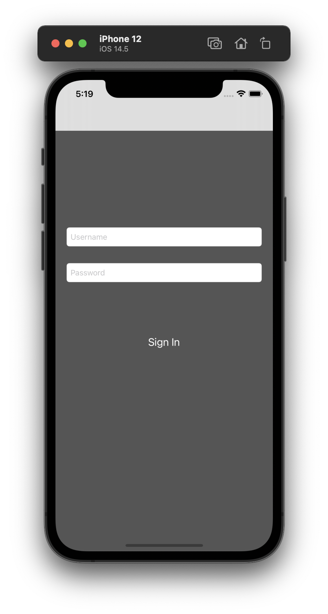
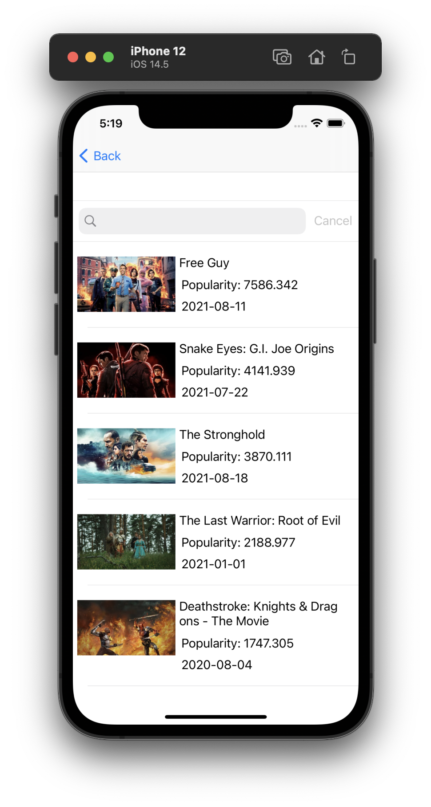
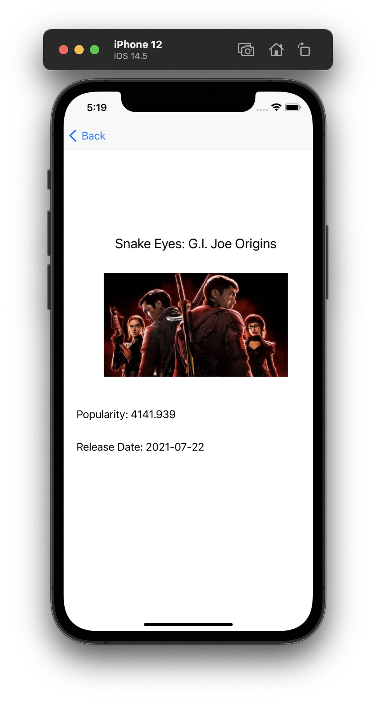

# MovieList

This application was created on September 30, 2021 by Ethan Rockel

The Movie List Application takes data from a website and creates a list of all of the recent movies that are out in theater. The user is able to interact
with the list and can check out all of the release dates, titles, movie posters and popularity.

Sorry in advance for the large pictures, I couldn't find a way to alter them here without them being super blurry

This is the first screen you'll see when you launch the application

After signing in, you will be directed to the list of all the movies in the MovieList view

If you select a row of a movie you're interested in, you will be directed to the detailView screen where there is info about the movie

